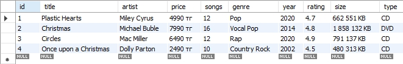
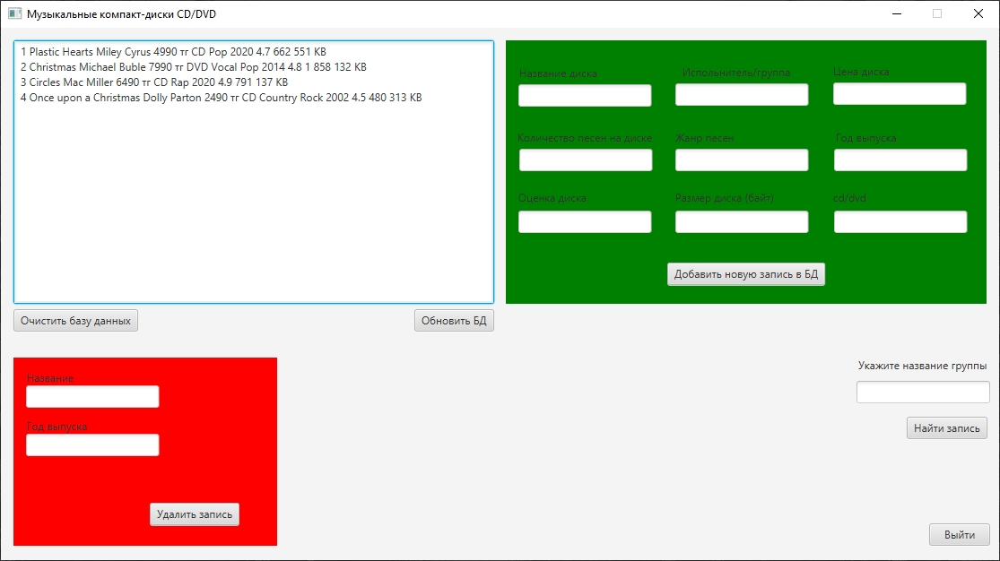
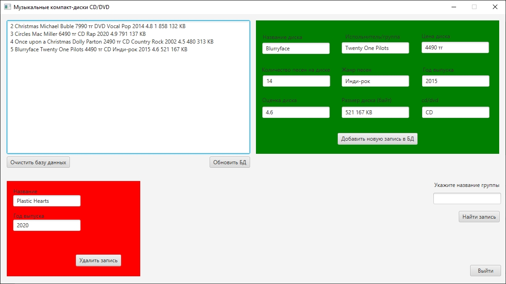
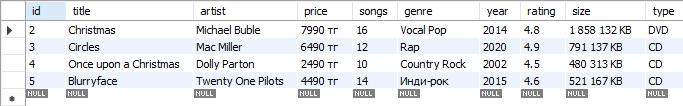

# Курсовая работа 
## Интерфейс управления базой данных MySQL с помощью технологий Spring Framework + JavaFX
## Вариант - 1
## Предметная область "Музыкальные компакт-диски CD/DVD"
Начальное состояние таблицы

Экспортирование записей из таблицы MySQL в текстовое поле JavaFX

Добавление новой записи в таблицу

Удаление строки из таблицы

Нахождение записи в таблице по названию диска

Конечное состояние таблицы

### Скрипт таблицы MySQL
CREATE TABLE IF NOT EXISTS disks.disks (
    `id` INT NOT NULL AUTO_INCREMENT,
    `title` VARCHAR(45) NULL DEFAULT NULL,
    `artist` VARCHAR(45) NULL DEFAULT NULL,
    `price` VARCHAR(15) NULL DEFAULT NULL,
    `songs` VARCHAR(5) NULL DEFAULT NULL,
    `genre` VARCHAR(20) NULL DEFAULT NULL,
    `year` INT NULL DEFAULT NULL,
    `rating` decimal(2,1) NULL DEFAULT NULL,
    `size` VARCHAR(45) NULL DEFAULT NULL,
    `type` VARCHAR(3) NULL DEFAULT NULL,
    PRIMARY KEY (`id`)
)  ENGINE=INNODB DEFAULT CHARSET=UTF8mb4;

INSERT INTO disks (title, artist, price, songs, genre, year, rating, size, type) VALUES ("Plastic Hearts", "Miley Cyrus", "4990 тг", "12", "Pop", "2020", "4.7", "662 551 KB", "CD");
INSERT INTO disks (title, artist, price, songs, genre, year, rating, size, type) VALUES ("Christmas", "Michael Buble", "7990 тг", "16", "Vocal Pop", "2014", "4.8", "1 858 132 KB", "DVD");
INSERT INTO disks (title, artist, price, songs, genre, year, rating, size, type) VALUES ("Circles", "Mac Miller", "6490 тг", "12", "Rap", "2020", "4.9", "791 137 KB", "CD");
INSERT INTO disks (title, artist, price, songs, genre, year, rating, size, type) VALUES ("Once upon a Christmas", "Dolly Parton", "2490 тг", "10", "Country Rock", "2002", "4.5", "480 313 KB", "CD");
